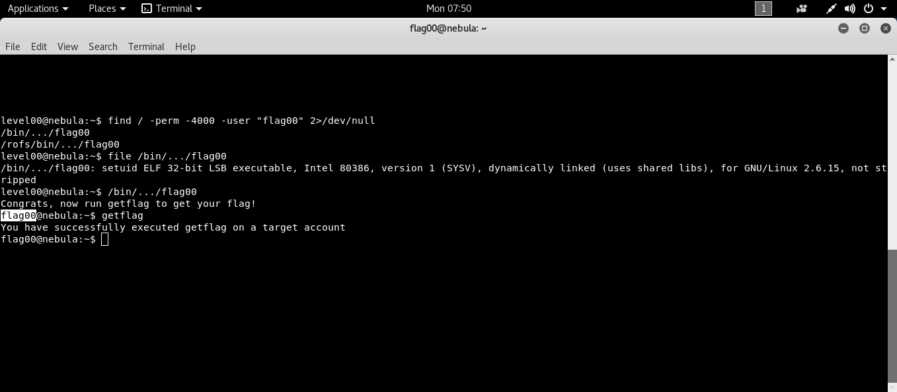

```bash
ssh level00@192.168.154.137 # [nebulaIP]
```
Bu seviyede suid biti atanmış ve flag00 kullanıcısına ait olan dosyayı bulmamızı istiyor.

```bash
find / -perm -4000 -name "flag00" 2> /dev/null
/bin/.../flag00
getflag
```

