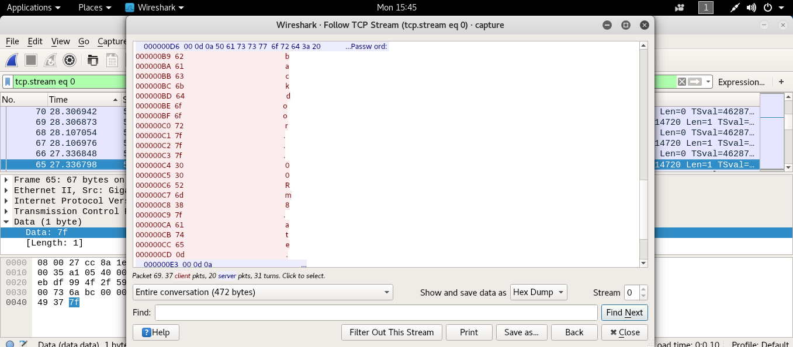

```bash
ssh level08@192.168.154.137 # [nebulaIP]
```
```
level08@nebula:/home/flag08$ ls
capture.pcap
```
```
root@kali:~# scp level08@192.168.154.137:/home/flag08/capture.pcap .
root@kali:~# wireshark capture.pcap
```



7f ler back-space e karşılık geliyor. Parolamız: backd00Rmate
